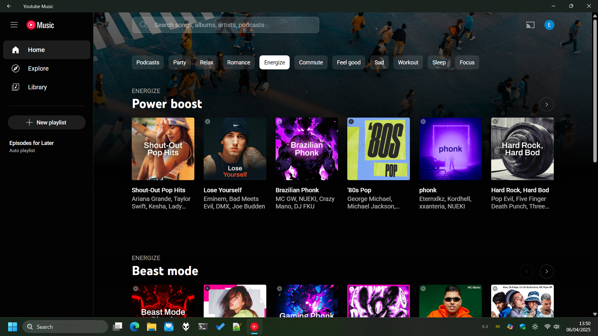

# YT Music for Windows
YT Music app that uses Edge WebView2

## Features (Edge WebView2)
- Lighter than Electron
- Does not require Microsoft Edge
- Up to date webview based on the current version of Chromium
- Shared instance with other webview apps running (less memory)
- Supports efficent mode for background processes (less battery)
- Media controls on quick settings / Media shortcuts from the keyboard
- Opens the app much faster compared to alternatives
- Uses native scrollbars that support dark mode
- Back button on the top-left

## How to install
- Enable "developer mode" on the Settings app
- Allow the execution of local PowerShell scripts in the same tab
- Download the zip file from releases
- Extract it to a folder
- Right-click `Install.ps1` and select Run with `PowerShell`

## Reference
- [Install Edge WebView2 if not available on the system](https://developer.microsoft.com/en-us/microsoft-edge/webview2/consumer/)
- [WebView2 in WinUI 2 (UWP) apps](https://learn.microsoft.com/en-us/microsoft-edge/webview2/platforms/winui2-uwp)